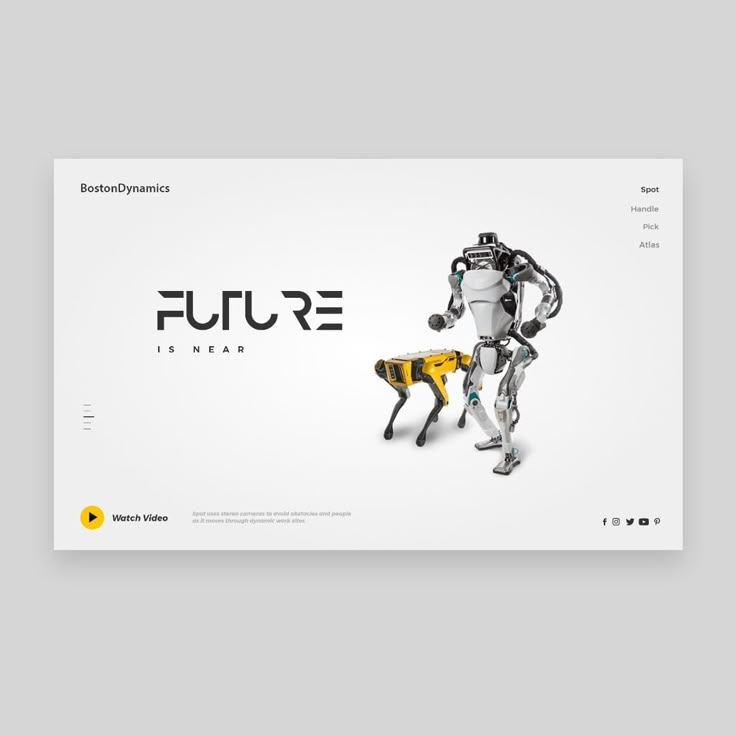

# Robotics

_website design project_

<br>

## 🌟 About

This project is for educational porpuses only. Pull request are welcome, but priority for project authors! Thank you for your cooperation!

Site published at: https://ketleriuslinas.github.io/html-css-project-robotics/

Design: 

## 🎯 Project features/goals

-   Github pages
-   no responsive design
-   CSS file
-   FontAwesome icons
-   display: flex
-   hover state
-   bash commands:
    -   `touch index.html` (sukuria faila)
    -   `touch failas1.txt failas2.txt failas3.txt failas4.txt`
    -   `mkdir img` (sukuria folderi/direktorija)
    -   `mkdir folder1 folder2 folder3 folder4`
    -   `ls -al` (stulpeliu atvaizduoja direktorijoje esanti turini)
    -   `rm failo pavadinimas` (pasalina faila)
-   git commands:
    -   `git init`
    -   `git add .`
    -   `git commit -m "Message text"`
    -   `git push`

## 🧰 Getting Started

### 💻 Prerequisites

Node.js - _download and install_

```
https://nodejs.org
```

Git - _download and install_

```
https://git-scm.com
```

### 🏃 Run locally

Would like to run this project locally? Open terminal and follow these steps:

1. Clone the repo
    ```sh
    git clone https://github.com/KetleriusLinas/html-css-project-robotics
    ```
2. Install NPM packages
    ```sh
    npm i
    ```
    or
    ```sh
    npm install
    ```
3. Run the server
    ```sh
    npm run dev
    ```

### 🧪 Running tests

There is no tests for this project.

## 🎅 Authors

Linas: [Github](https://github.com/KetleriusLinas)

## ⚠️ License

Distributed under the MIT License. See LICENSE.txt for more information.

## 🔗 Other resources

No other resources.